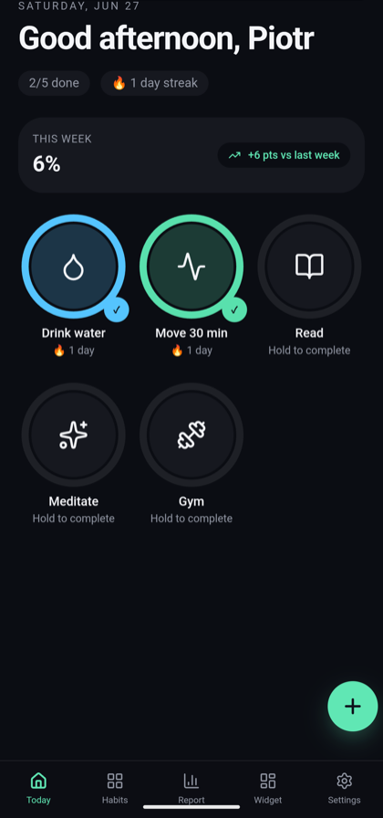
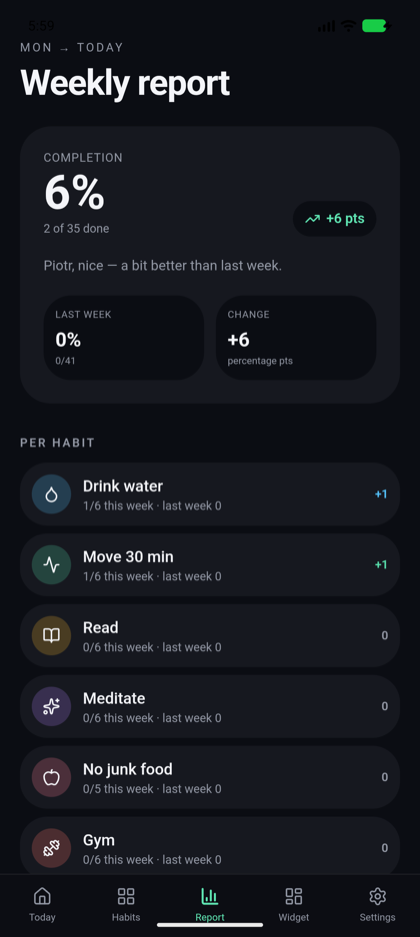
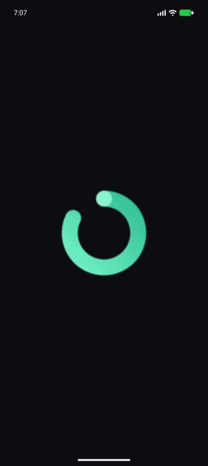
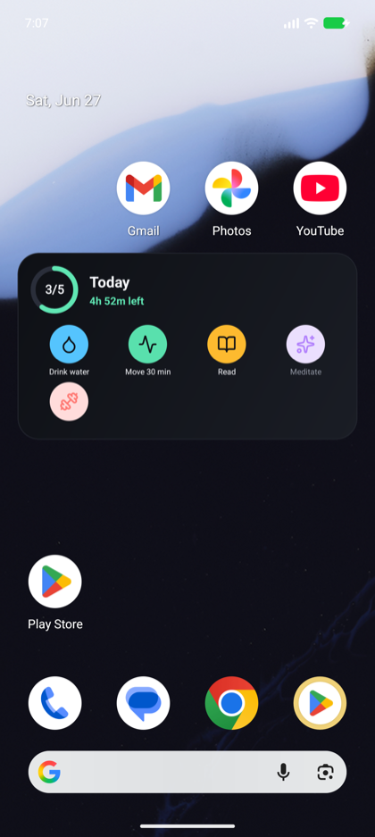
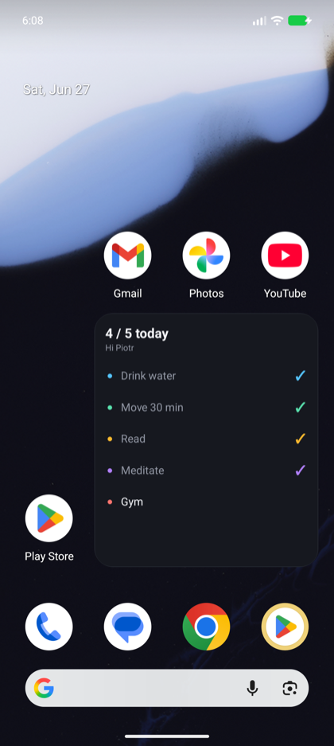

# Loop - Habit Tracker

Build healthy habits and keep your streak alive. Loop is a fast, offline-first
habit tracker that runs as a web app **and** as a native Android app with two
**home-screen widgets** you can tick habits off from - without opening the app.

<p align="center">
  
  
  
</p>
<p align="center">
  
  
</p>

> Top: Today, Weekly report, splash screen. Bottom: the two **home-screen
> widgets** - an icon widget (progress ring + time left in the day) and a simple
> list, both with tap-to-complete.

## Download

Grab the latest signed APK from the
[**Releases**](https://github.com/pi0trdotsys/glow-habit-widget/releases/latest)
page and sideload it (you'll need to allow "install from unknown sources").

> The app replaces any earlier TWA build of Loop - same package id
> (`app.lovable.glow_habit_widget`). Uninstall the old one first if present.

## Features

- **Daily / weekday / times-per-week** habit schedules
- **Hold to complete** with streaks and weekly progress
- **70+ habit icons** to pick from (hygiene, fitness, food, mind, work,
  nature and more, including a dedicated tooth icon for brushing habits)
- **Native notifications**:
  - **Per-habit reminders** - set a time on any habit's page to be nudged daily
  - **Daily check-in** reminder at a time you choose
  - **Weekly recap** notification that nudges you to compare this week vs last
- **Weekly report** with per-habit breakdown
- **Two native home-screen widgets** (both 4x2, tap-to-toggle):
  - **Icon widget** - habit icons, a progress ring, and time left in the day
  - **List widget** - today's habits as a simple list with progress
  - both **reset automatically at midnight** for the new day
- **Minimalist splash screen** and a custom adaptive app icon
- **100% offline** - all data lives on-device (no account, no backend)

## Tech stack

- [TanStack Start](https://tanstack.com/start) (React 19, file-based routing)
- Tailwind CSS v4, Radix UI, Zustand (persisted to `localStorage`)
- [Capacitor](https://capacitorjs.com/) for the native Android shell
  (Preferences, Splash Screen, Local Notifications plugins)
- Two native Android **App Widgets** (Java, `RemoteViews`; icons from lucide
  converted to vector drawables, progress ring drawn on a `Canvas`)

## How the home-screen widget works

The web app is fully client-side; its data lives in `localStorage`. A native
widget can't read that, so habit data is bridged into Android `SharedPreferences`:

```
Web app (Zustand → localStorage)
   │  startWidgetBridge()  - native only, no-op on web
   ▼
@capacitor/preferences  →  SharedPreferences "CapacitorStorage"
   │   widget_state  (today's snapshot)
   │   widget_pending (taps queued while the app is closed)
   ▼
Both App Widgets (RemoteViews) - render habits + progress; the icon widget
   │   also computes time-left-in-day natively
   │   tap a habit → updates the snapshot + queues an absolute-state op
   ▼
App reconciles the queue on next open (idempotent), then re-publishes
```

Key files: [`src/lib/widget/bridge.ts`](src/lib/widget/bridge.ts) and
[`android/app/src/main/java/app/lovable/glow_habit_widget/`](android/app/src/main/java/app/lovable/glow_habit_widget/).

## Development (web)

```bash
bun install
bun run dev          # http://localhost:8080
bun run build        # production SSR build (used for web deploy)
```

## Building the Android app

Requirements: **JDK 21** (Capacitor 8), Android SDK with `build-tools;34.0.0`.

```bash
# 1. Static, client-only SPA build for Capacitor (separate from the SSR build)
bun run build:cap
bun x cap sync android

# 2. Build a release APK
cd android
JAVA_HOME=/path/to/jdk-21 ./gradlew :app:assembleRelease

# 3. Align + sign (replace with your keystore)
$ANDROID_HOME/build-tools/34.0.0/zipalign -f -p 4 \
  app/build/outputs/apk/release/app-release-unsigned.apk app-aligned.apk
$ANDROID_HOME/build-tools/34.0.0/apksigner sign \
  --ks your.keystore --ks-key-alias your-alias \
  --out loop-release.apk app-aligned.apk
```

Then install with `adb install -r loop-release.apk` and add the **Loop** widget
from the launcher's widget picker.

> The widget is empty until you open the app once - that first launch publishes
> the snapshot the widget reads.
